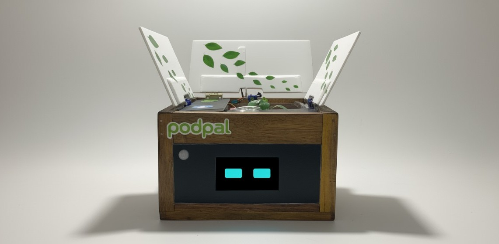
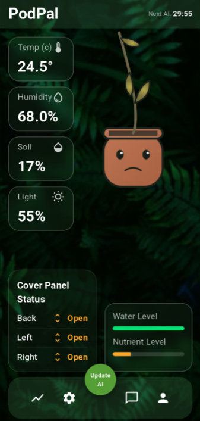
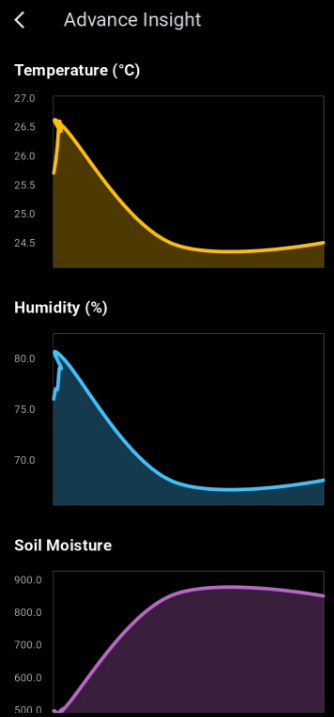

# Project PodPal: An AI-Enhanced Autonomous Gardening System



<p align="center">
  <em>An intelligent, self-managing ecosystem that makes expert-level gardening effortless by combining cloud-based AI with real-time, offline-capable hardware instincts.</em>
</p>

<p align="center">
  
  
  
</p>

---

## 📖 Table of Contents

- [The Problem](#-the-problem)
- [The Solution](#-the-solution)
- [Live Demonstration](#-live-demonstration)
- [Key Features](#-key-features)
- [System Architecture](#-system-architecture)
- [Hardware & Electronics](#-hardware--electronics)
- [Software & Mobile App](#-software--mobile-app)
- [Getting Started](#-getting-started)
- [Skills Demonstrated](#-skills-demonstrated)

---

## 🎯 The Problem

While many people aspire to grow fresh, healthy food at home, success is often limited by a lack of time, knowledge, and consistent care. Current "smart" gardening solutions are often just glorified timers or single-function alert systems—they help, but they don't truly _manage_. They still place the burden of complex decision-making on the user.

## 💡 The Solution

**PodPal** is a fully autonomous, self-managing ecosystem that replaces human guesswork with data-driven perfection. It is a complete life-support system for a plant, using a suite of sensors and actuators to actively manage water, light, temperature, and nutrients 24/7.

---

## 🎬 Live Demonstration

The system features three servo-controlled covers that open and close based on ambient light levels, managed by the Pod's real-time instincts.


---

## ✨ Key Features

- **Fully Autonomous Control:** Automatically manages watering, nutrient cycles, light exposure, humidity, and temperature.
- **AI-Driven Growth Plans:** A mobile app analyzes historical data to generate and send optimized operating thresholds to the Pod.
- **Resilient & Offline Capable:** The Pod's local "instincts" continue to function perfectly using the last received plan even if the WiFi connection is lost.
- **Dynamic Actuators:** Features servo-controlled covers to manage light and a Z-axis lift (in development) that grows with the plant.
- **Real-Time Monitoring:** A mobile app provides a live dashboard of all sensor readings and historical data charts.

---

## 🏛️ System Architecture

The intelligence of PodPal is our **"AI Guardian Angel"** system, a unique 3-layer architecture designed for maximum intelligence and resilience.

1.  **Layer 1: The AI Strategist (Cloud):** The Flutter mobile app acts as the long-term planner, sending strategic "growth plans" to the Pod.
2.  **Layer 2: The Pod's Instincts (Device):** The Arduino Due executes the plan with instant, tactical responses 24/7, even without an internet connection.
3.  **Layer 3: The Failsafe (Backup):** A hardcoded survival mode that activates if connectivity is lost for an extended period, guaranteeing the plant's safety.

---

## 🛠️ Hardware & Electronics

The hardware was engineered for stability and robustness, centered around key professional design choices.

- **Dual-Brain Design:** An **Arduino Due** acts as the real-time 'workhorse' for all sensors and actuators. A separate **ESP8266** is the dedicated 'communicator' for WiFi. This **'Serial Bridge'** architecture prevents network lag from ever affecting the plant's safety.
- **Isolated Power Supplies:** A dedicated **LM2596 Buck Converter** creates a clean, stable 5V source for all sensitive servos, isolating them from the electrical 'noise' and voltage drops caused by the pumps and motors. This was a critical solution to solve servo jitter.
- **High-Power Load Control:** A **MOSFET driver circuit using a BC547 transistor** allows the Arduino's low-power 3.3V signal to safely and efficiently switch the 5V and 12V loads for the pumps and fan.

```mermaid
graph TD
    subgraph PowerSystem["Power System"]
        A[12V DC Adapter] --> B[LM2596 Buck Converter];
        B --> C[5V Servo Power Rail];
        A --> D[12V Rail for Fan/Light];
    end

    subgraph Microcontrollers
        E[ESP8266] -- "Serial Bridge (TX/RX)" --> F[Arduino Due];
    end

    subgraph Drivers
        F -- "Pin 12 (Signal)" --> G["Pump 1 Driver (BC547+MOSFET)"];
        F -- "Pin 8 (Signal)" --> H["Fan Driver (BC547+MOSFET)"];
    end

    subgraph Actuators
        I[Pump 1]
        J[Fan]
        K[Servos]
    end

    D -- "12V Power" --> H;
    F -- "5V from Arduino" --> G; %% Or wherever the pump driver gets power
    G -- "Switched Power" --> I;
    H -- "Switched Power" --> J;
    C -- "5V Power" --> K;

    style A fill:#f9f,stroke:#333,stroke-width:2px
    style E fill:#9cf,stroke:#333,stroke-width:2px
    style F fill:#9cf,stroke:#333,stroke-width:2px
```

---

## 📱 Software & Mobile App

The software stack was chosen for performance, scalability, and future-proofing.

- **Cross-Platform App (Flutter):** The mobile app is developed in **Flutter**, allowing a single codebase to create high-performance native apps for both Android and iOS.
- **Reliable Communication (JSON API):** Communication is handled by a simple and robust **JSON API** served by the ESP8266.
- **Scalable Architecture (Repository Pattern):** The app uses the **Repository Pattern**, creating a 'wall' between the user interface and the data source. This makes the app incredibly flexible and allows for future hardware changes without needing to rebuild the app's UI.

|                Home Screen                 |                  Data Charts                   |
| :----------------------------------------: | :--------------------------------------------: |
|  |  |

---

## 🚀 Getting Started

1.  **Hardware:** Assemble the circuit as per the provided diagrams. A common ground is required for all power supplies (Arduino USB, 5V, 12V).
2.  **Firmware:**
    - Upload the code from the **`Arduino_Due_Code/`** folder to the Arduino Due.
    - Update the WiFi credentials in the **`ESP8266_Code.ino`** file and upload it to the ESP8266.
3.  **App:** The companion app is built with Flutter (repository can be linked here).

---

## 🎓 Skills Demonstrated

This project showcases a wide range of skills in embedded systems engineering and IoT product development:

- **Embedded Systems Programming (C++/Arduino)**
- **IoT & Network Communication (ESP8266, WiFi, JSON API)**
- **Electronic Circuit Design & Prototyping**
- **Power Electronics (MOSFET Drivers, Buck Converters, Power Isolation)**
- **Mobile App Development (Flutter)**
- **System Architecture & Design Patterns**
- **Sensor Integration & Data Processing**

---

### License

This project is licensed under the MIT License - see the [LICENSE](LICENSE) file for details.
